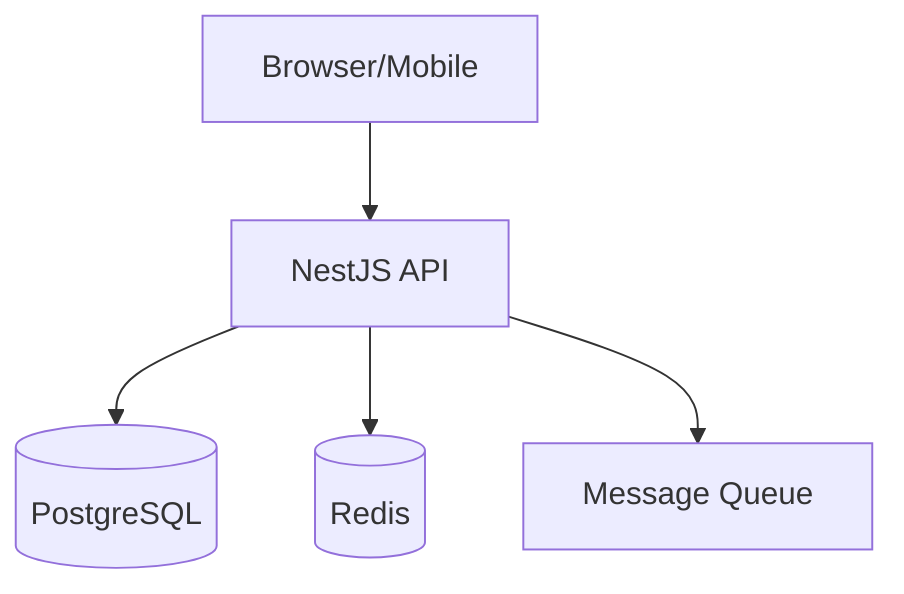

# Templates SDD — AI Dev Team

Copie estes templates para `specs/[feature-name]/` ao iniciar qualquer nova feature.

---

## 📄 PRD Template (`docs/prd.md`)

```markdown
# Product Requirements Document
**Produto:** [Nome]
**Feature/Épico:** [Nome]
**Versão:** 1.0
**Status:** Draft | Review | Approved
**PM/PO responsável:** [nome]
**Data:** [YYYY-MM-DD]

---

## 1. Problema e Oportunidade
[Qual problema real estamos resolvendo? Qual oportunidade estamos capturando?]

## 2. Objetivos e Métricas de Sucesso
| Objetivo | Métrica | Meta | Prazo |
|---------|---------|------|-------|
| [objetivo] | [como medir] | [número] | [data] |

## 3. Usuários e Personas
**Persona Primária:** [Nome — quem usa mais]
- Contexto: [situação em que usa]
- Necessidade: [o que precisa fazer]
- Frustração atual: [como resolve hoje]

## 4. Funcionalidades Desejadas (High-Level)
### Must Have (MVP)
- [ ] [funcionalidade]

### Should Have (fase 2)
- [ ] [funcionalidade]

### Nice to Have (backlog)
- [ ] [funcionalidade]

## 5. Não-Objetivos (Non-Goals)
[O que explicitamente NÃO será feito. Crucial para focar o esforço.]

## 6. Premissas e Restrições
- **Premissa:** [algo assumido como verdadeiro]
- **Restrição técnica:** [limitação]
- **Restrição de negócio:** [limitação]

## 7. Perguntas em Aberto
- [ ] [questão que precisa ser respondida antes de iniciar]

## 8. Referências
- [link ou documento relevante]
```

---

## 📄 CLAUDE.md Template (para projetos)

```markdown
# [Project Name] — Guia do Agente

## Stack
- **Backend:** NestJS + TypeScript + PostgreSQL + Prisma
- **Frontend:** Next.js 14 (App Router) + TypeScript + Tailwind CSS + shadcn/ui
- **Runtime:** Node.js 20+
- **Package manager:** pnpm

## Comandos Essenciais
```bash
# Dev
pnpm dev              # inicia backend e frontend
pnpm db:migrate       # executa migrations pendentes
pnpm db:studio        # abre Prisma Studio

# Testes
pnpm test             # unit tests
pnpm test:e2e         # integration tests
pnpm test:cov         # coverage report

# Build
pnpm build            # build de produção
pnpm lint             # ESLint + Prettier check
```

## Estrutura de Pastas
```
apps/
  backend/
    src/
      modules/[feature]/   # cada feature tem seu módulo
      common/              # guards, decorators, pipes globais
      config/              # configurações de ambiente
  frontend/
    app/                   # Next.js App Router
    components/
      ui/                  # shadcn/ui components
      [feature]/           # componentes específicos de feature
    hooks/
    lib/
      api/                 # funções de chamada de API
```

## Convenções
- Nomes de arquivos: `kebab-case.ts`
- Nomes de classes: `PascalCase`
- Nomes de variáveis/funções: `camelCase`
- Constantes: `UPPER_SNAKE_CASE`
- Branches: `feature/[task-id]-[short-desc]`
- Commits: `type(scope): descrição — refs TASK-XXX`

## Regras Específicas do Projeto
- NUNCA use `any` no TypeScript — use `unknown` ou defina o tipo correto
- SEMPRE use UUIDs para IDs de entidades (não autoincrement)
- SEMPRE inclua `created_at` e `updated_at` em toda entidade
- Soft delete obrigatório em entidades de negócio (campo `deleted_at`)
- Rate limiting obrigatório em todos os endpoints públicos
- Toda API response segue o padrão: `{ success: boolean, data?: T, error?: ErrorShape }`

## Contexto do Domínio
[Explique aqui o domínio do negócio em 3-5 frases. O que o sistema faz, para quem, e termos importantes do domínio.]
```

---

## 📄 progress.md Template (`docs/progress.md`)

```markdown
# Progress — [Project Name]
> Atualizado por agentes ao final de cada task. Leia antes de iniciar qualquer sessão.

**Última atualização:** [data]
**Fase atual:** Planning | Development | Review | QA | Produção

---

## Status Geral
| Épico | Tasks | Concluídas | Em progresso | Bloqueadas |
|-------|-------|-----------|--------------|------------|
| [nome] | X | X | X | X |

---

## Em Progresso
- **TASK-XXX:** [título] — [responsável] — [o que falta]

## Concluído Recentemente
- ✅ **TASK-XXX:** [título] — [data]

## Bloqueado
- ❌ **TASK-XXX:** [título] — **Bloqueador:** [razão]

## Decisões Tomadas (ADRs resumidos)
- **[data]:** [decisão] — [razão em 1 linha]

## Próximos Passos
1. [próxima ação imediata]
2. [segunda ação]

## Dívidas Técnicas Registradas
- TD-001: [descrição] — [impacto] — [prioridade]
```

---

## 📄 architecture.md Template (`docs/architecture.md`)

```markdown
# Architecture Decision Records — [Project Name]

## Stack Decisions

### ADR-001: [Decisão]
**Data:** [YYYY-MM-DD]
**Status:** Accepted | Deprecated | Superseded by ADR-XXX

**Contexto:**
[Por que essa decisão foi necessária]

**Opções Consideradas:**
1. [opção A]
2. [opção B]

**Decisão:** [opção escolhida]

**Consequências:**
- Positivas: [o que fica melhor]
- Negativas: [o que fica pior / trade-offs]

---

## Diagrama de Alto Nível
[Diagrama em Mermaid ou referência ao Excalidraw]



## Módulos do Sistema
| Módulo | Responsabilidade | Depende de |
|--------|-----------------|------------|
| Auth | Autenticação e autorização | Users |
| Users | Gestão de usuários | — |
| [feature] | [o que faz] | [dependências] |
```
